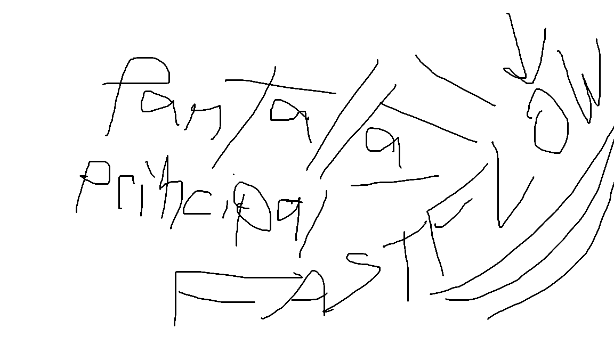
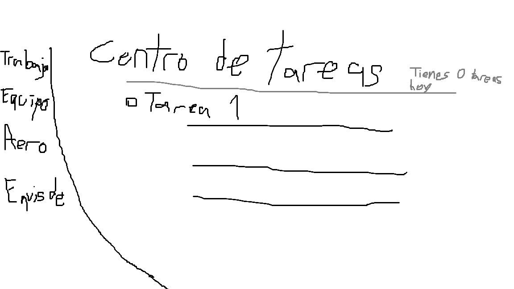
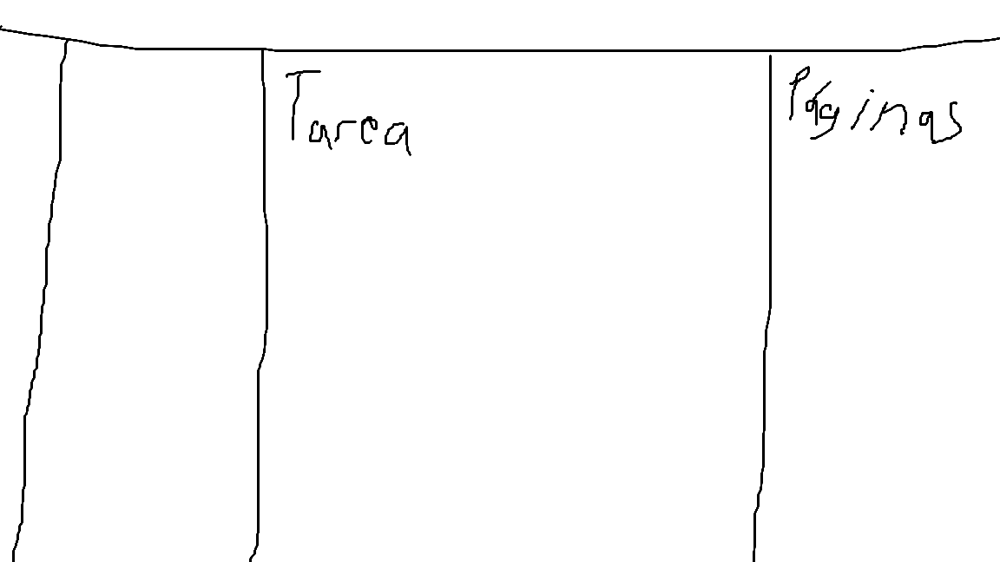

# TaskFlow
Aplicación sencilla para administrar tareas en equipo

## Tabla de contenidos

- [Descripción](#descripción)
--[Capturas de pantalla](#capturas-de-pantalla)
- [Funcionalidades](#funcionalidades)
- [Tecnologías](#lista-de-tecnologías-utilizadas)
- [Requisitos](#requisitos)
- [Lista de funcionalidades](#lista-de-funcionalidades)
- [Instalación](#instalación)
- [Contribuidores](#contribuidores)

## Descripción
TaskFlow es una herramienta intuitiva que ayuda a organizar tareas en tu equipo.

## Capturas de pantalla
### Pantalla principal

### Inicio de sesión

### Pantalla principal de la funcionalidad

### Trabajo en proceso

## Funcionalidades
Puedes registrar tareas y editar tareas, más funciones vienen en camino.

## Lista de tecnologías utilizadas
- Lenguaje Python
- Lenguaje C++

## Requisitos
- Sistema operativo Windows
- Acceso a internet o a tu red local

## Lista de Funcionalidades
- [x] Registrar tareas
- [x] Editar tareas
- [ ] Eliminar tareas
- [ ] Asignar tareas a usuarios

## Instalación
1. Clonar el repositorio.
2. Configurar la base de datos.
3. Configurar las variables necesarias.
4. Ejecutar la aplicación.

## Contribuidores
- Matías Alejandro Marcoro
- Tobías Huaccachi Contreras
- Joaquín

