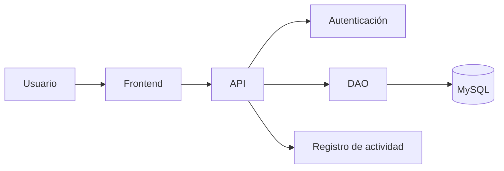

# TaskFlow
Aplicación sencilla para administrar tareas en equipo

## Tabla de contenidos

- [Descripción](#descripción)
- [Capturas de pantalla](#capturas-de-pantalla)
- [Arquitectura](#arquitectura)
- [Funcionalidades](#funcionalidades)
- [Tecnologías](#lista-de-tecnologías-utilizadas)
- [Requisitos](#requisitos)
- [Lista de funcionalidades](#lista-de-funcionalidades)
- [Instalación](#instalación)
- [Uso](#uso)
- [Contribuidores](#contribuidores)
- [Licencia](#licencia)

## Descripción
TaskFlow es una herramienta intuitiva que ayuda a organizar tareas en tu equipo.

## Capturas de pantalla
### Pantalla principal

### Inicio de sesión

### Pantalla principal de la funcionalidad

### Trabajo en proceso

## Arquitectura
La aplicación está organizada en diferentes componentes que permiten gestionar la interacción con el usuario, la autenticación, el acceso a datos y el registro de actividades.

## Funcionalidades
Puedes registrar tareas y editar tareas, más funciones vienen en camino.

## Lista de tecnologías utilizadas
- Lenguaje Python
- Lenguaje C++

## Requisitos
- Sistema operativo Windows
- Acceso a internet o a tu red local

## Lista de Funcionalidades
- [x] Registrar tareas
- [x] Editar tareas
- [ ] Eliminar tareas
- [ ] Asignar tareas a usuarios

## Instalación
1. Clonar el repositorio.
2. Configurar la base de datos.
3. Configurar las variables necesarias.
4. Ejecutar la aplicación.

## Uso
Haga click en la pantalla principal, esto lo llevará a la pantalla de iniciar sesión, debe ingresar el correo electrónico y la contraseña creada para su cuenta de fastflow o de otro modo no podrá utilizar la aplicación, en caso que no esté registrado o no recuerde su contraseña, puede crear una cuenta nueva o reemplazar su contraseña actual haciendo click a cualquiera de las dos oraciones en la parte inferior central.

Una vez ingresado sesión, verá su Centro de tareas y cuántas tareas tiene para hoy, aquí puede ver, registrar y continuar tareas, al lado izquierdo están las secciones de Trabajo, Equipo, Aero y Equisde, la sección de trabajo le permite ver con más detalle las tareas que tiene, la sección equipo los equipos con los que se encuentra trabajando al momento, con los que ha trabajado antes también, Aero activa mayor iluminación y transparencia a la interfaz, y Equisde es el chiste del día.

## Contribuidores
- Matías Alejandro Marcoro
- Tobías Huaccachi Contreras
- Joaquín

## Licencia
CC BY 2.0, Creative Commons
